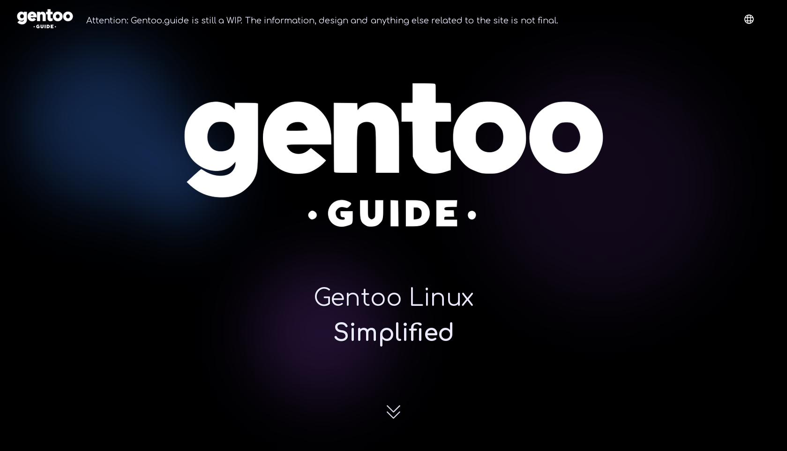

# [Wanna contribute? Click here 1st!](https://)



# **Gentoo.guide**

#### Gentoo linux simplified

<br/>

### An install and configuration guide for gentoo linux that is all form over function 😉

### Written using NextJS with handcrafted UI, built with TailwindCSS and Framer motion 🌠

<br/><br/>

## Start your own, very form over function gentoo guide by following these steps:

<br/>

1. Clone this repository
   <br/><br/>
2. ```bash
   cd Gentoo.guide
   ```
3. ```bash
   npm i
   ```
4. ```bash
   npm run build
   ```

#### After this, to start the server just type:

```bash
  npm run start
```

### And, that's it! You can now connect to it from the browser, by going to **http://localhost:3000**
